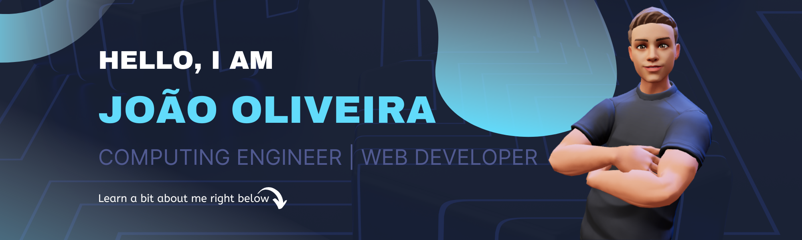

  
  
  <strong>You can view my top projects live on my portfolio</strong>
  
  
  
  <strong>Get in touch</strong>
  
  
  
  

## 📰 About Me

I am a computer engineering graduate focused in front-end web development with React.js and its ecosystem. I spend my free time developing projects using React and vanilla JavaScript, and I enjoy tackling challenges on <a href="https://www.codewars.com/users/jvmdo">CodeWars</a>.

I have a solid understanding of the three foundational languages that make up the front-end web development stack: HTML, CSS, and JavaScript. As for ReactJS, while I have intermediate-level knowledge of the library, I am constantly expanding my skills and knowledge with each new project I build. I enjoy the challenge of working with React and discovering new ways to build dynamic, user-friendly web applications.

## 🤓 Stuff I Know

## 📓 Stuff to Learn Soon

## 👀 Stuff to get a Peek

## Stats

